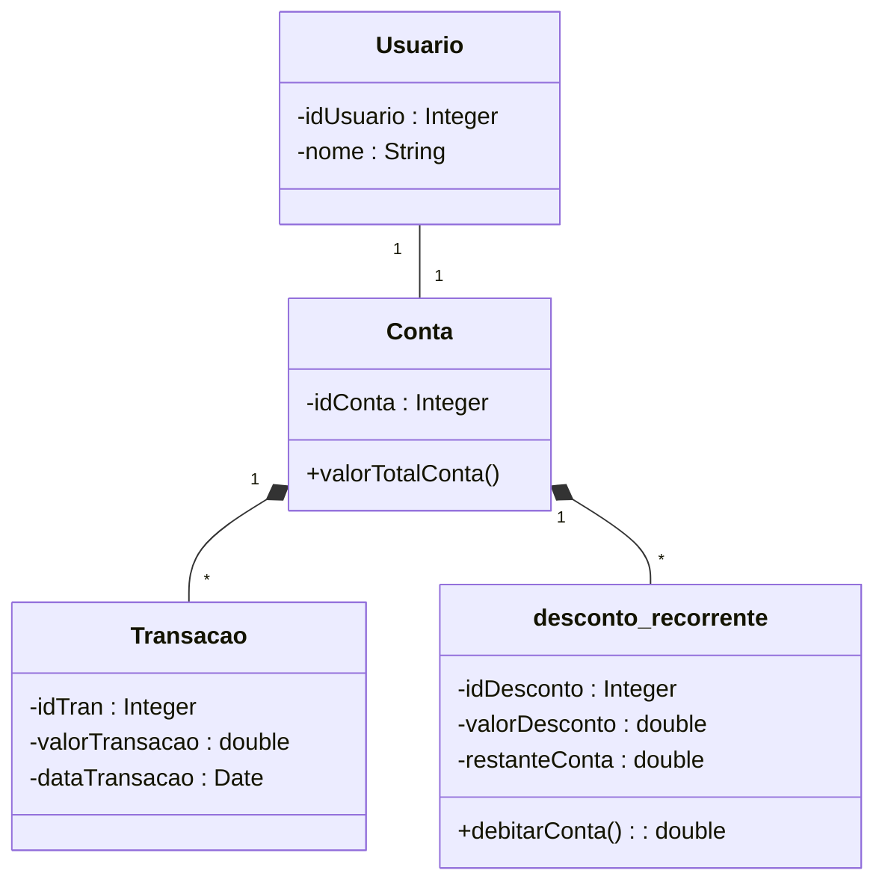

```mermaid
classDiagram
Usuario "1" -- "1" Conta
Conta "1" *-- "*" Transacao
Conta "1" *-- "*" desconto_recorrente


class Usuario {
-idUsuario : Integer
-nome : String
}

class Transacao {
-idTran : Integer
-valorTransacao : double
-dataTransacao : Date
}

class Conta {
-idConta : Integer
+valorTotalConta()
}

class desconto_recorrente {
-idDesconto : Integer
-valorDesconto : double
-restanteConta : double
+debitarConta() : double
}
```