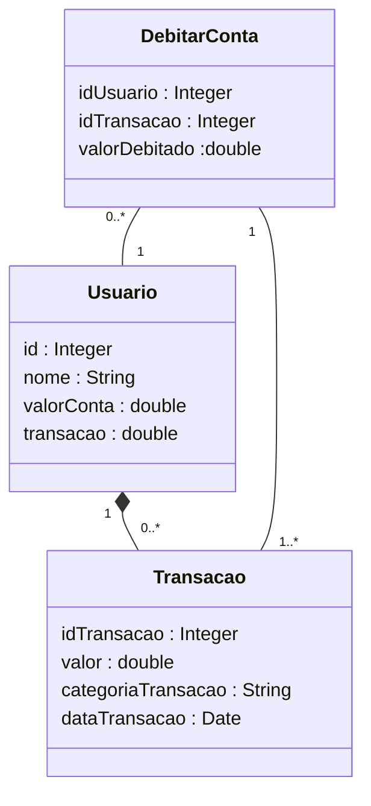

```mermaid
classDiagram
Usuario "1" *-- "0..*" Transacao
DebitarConta "0..*" -- "1" Usuario
DebitarConta "1" -- "1..*" Transacao

class Usuario {
    id : Integer
    nome : String
    valorConta : double
    transacao : double
}

class Transacao {
    idTransacao : Integer
    valor : double
    categoriaTransacao : String
    dataTransacao : Date
}

class DebitarConta {
    idUsuario : Integer
    idTransacao : Integer
    valorDebitado :double
}
```